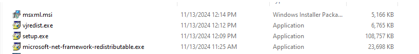

# CH341A tool
Windows application adding extra functionality to popular EEPROM/FLASH programmer based on CH341A.

https://tomeko.net/software/CH341A_tool/

## Compiling

This application is built with Turbo C++ Explorer 2006 (free version of BDS 2006, aka C++ Builder).
Use CH341A_tool_all.bdsgroup project group file to build all included projects, CH341A_tool_exe.bdsgroup can be used later to build/rebuild only the main project.
### How to install IDE Turbo C++
Here is issue loop to get link for installing IDE turbocpp_en.exe: https://github.com/tomek-o/tSIP/issues/13 or you can get direct from http://194.71.11.165/mirror/archive/ftp.sunet.se/pub/lang/borland/

While you run setup, you must follow guide show on installing screen. You may install some prequisite as below:

For license after installing IDE, you need file reg740.txt from link https://azrael.digipen.edu/~mmead/www/Files/Borland/. And you need to put it into 
...\<User>\Documents\Borland Studio Projects\Bpl location.

## Learning further about VLC Form
This tool uses VLC Form to design UI. You can find them further from website https://www.functionx.com/cppbuilder/index.htm
